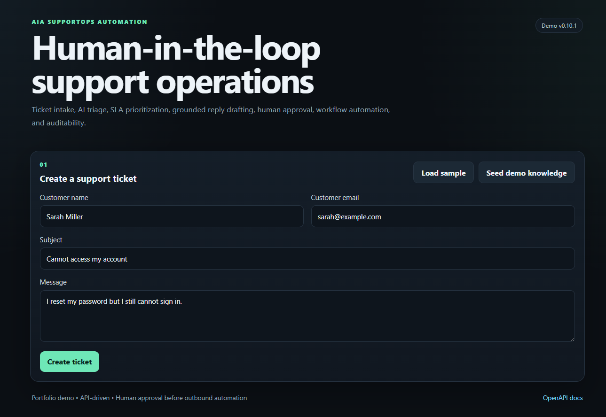
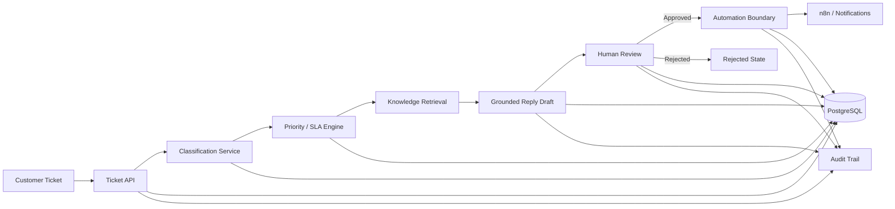

# AIA SupportOps Automation

[](https://github.com/iahai-labs/AIA_SupportOps_Automation/actions/workflows/ci.yml)

AI-assisted customer support operations with ticket triage, SLA prioritization, grounded reply drafting, human review, workflow automation, and auditability.

**Live Demo:** https://ai.iradhd.ir/supportops/



## Why this project exists

Support teams often lose time on repetitive operational work: reading tickets, deciding urgency, finding the right internal knowledge, drafting replies, escalating SLA risk, and keeping a reliable audit trail.

AIA SupportOps Automation turns that process into a controlled workflow:

```text
Customer Ticket
    ↓
AI Classification
    ↓
Priority & SLA
    ↓
Knowledge Retrieval
    ↓
Grounded Reply Draft
    ↓
Human Review
    ↓
Automation / Notification
    ↓
Audit Trail
```

The system is intentionally designed as **AI-assisted support operations**, not as an autonomous chatbot. Human approval remains an explicit boundary before outbound automation.

## Portfolio highlights

- FastAPI backend with SQLAlchemy persistence
- PostgreSQL production deployment
- structured AI classification with safe fallback
- deterministic priority and SLA rules
- grounded support knowledge retrieval
- reply drafting constrained by verified support context
- human approve / reject workflow
- n8n-compatible outbound automation boundary
- retry-state protection and audit trail
- responsive interactive demo UI
- demo-safe mode that disables paid/external execution by default
- Docker Compose production deployment
- HTTPS reverse proxy under a portfolio subpath
- automated quality gates with Ruff + pytest + GitHub Actions
- Dependabot, MIT license, and security policy

## Live demo workflow

1. Seed demo knowledge
2. Create ticket
3. Retrieve matching support knowledge
4. Generate draft
5. Approve or Reject
6. Refresh audit

The public demo runs in safe mode. External AI and outbound n8n execution are disabled by default.

## Architecture



More detail: [`docs/ARCHITECTURE.md`](docs/ARCHITECTURE.md)

## API surface

```text
POST /api/v1/tickets
GET  /api/v1/tickets/{ticket_id}
GET  /api/v1/tickets/{ticket_id}/knowledge
POST /api/v1/tickets/{ticket_id}/draft
POST /api/v1/tickets/{ticket_id}/approve
POST /api/v1/tickets/{ticket_id}/reject
POST /api/v1/tickets/{ticket_id}/automation/retry
GET  /api/v1/tickets/{ticket_id}/audit
POST /api/v1/knowledge
GET  /health
```

Interactive OpenAPI documentation is available from the live deployment at `/supportops/docs`.

## Reliability and safety decisions

- reply drafts are grounded in retrieved support knowledge
- no matching knowledge results in a safe human-review handoff
- AI provider failure falls back to deterministic behavior
- AI confidence is capped by retrieval confidence
- outbound automation follows human approval
- retry is blocked after a successful send
- automation failure does not roll back the approval decision
- the public demo disables external AI and n8n calls by default
- PostgreSQL is not exposed publicly
- the app binds to localhost behind Nginx

See [`docs/CASE_STUDY.md`](docs/CASE_STUDY.md).

## Production deployment

```text
Internet
   ↓
Cloudflare / HTTPS
   ↓
Nginx reverse proxy
   ↓
/supportops/ → 127.0.0.1:8003
   ↓
FastAPI container
   ↓
PostgreSQL container
```

Deployment details: [`docs/DEPLOYMENT.md`](docs/DEPLOYMENT.md)

## Local development

```bash
python -m pip install -r requirements.txt
uvicorn app.main:app --reload
```

Open:

```text
http://127.0.0.1:8000/demo
http://127.0.0.1:8000/docs
```

## Quality gates

```bash
python -m ruff check .
python -m pytest -q
```

CI runs the same quality gate on pushes and pull requests targeting `main`.

## Dependency and tooling files

- `requirements.txt` — pinned runtime/development dependencies for install, Docker, local development, and CI.
- `pyproject.toml` — project metadata plus pytest and Ruff configuration.

## Repository structure

```text
app/
docs/
tests/
```

Phase-specific implementation notes are kept under `docs/phase-*` so the repository root stays focused on project-level files.

## Case study

**Problem:** support teams repeatedly perform the same triage, lookup, drafting, escalation, and audit tasks.

**Constraints:** AI output cannot be blindly trusted; public demos should not expose secrets or incur uncontrolled API cost; outbound automation must be reviewable.

**Decisions:** separate classification, prioritization, retrieval, drafting, review, automation, and audit into explicit stages with deterministic fallbacks and human approval.

**Result:** a production-minded support operations workflow with a live demo, persisted state, auditability, automation boundaries, and deployment controls.

Full version: [`docs/CASE_STUDY.md`](docs/CASE_STUDY.md)

## Current status

Completed:
- ticket intake foundation
- AI classification
- priority and SLA engine
- knowledge retrieval
- grounded reply drafting
- human approval workflow
- automation / n8n integration boundary
- audit and reliability layer
- interactive demo UI
- production-safe deployment
- subpath-compatible live deployment

The final release gate is handled in Phase 12 before publishing `v1.0.0`.

## Security

Do not commit credentials, API keys, production `.env` files, or customer data.

See [`SECURITY.md`](SECURITY.md).

## License

MIT — see [`LICENSE`](LICENSE).
