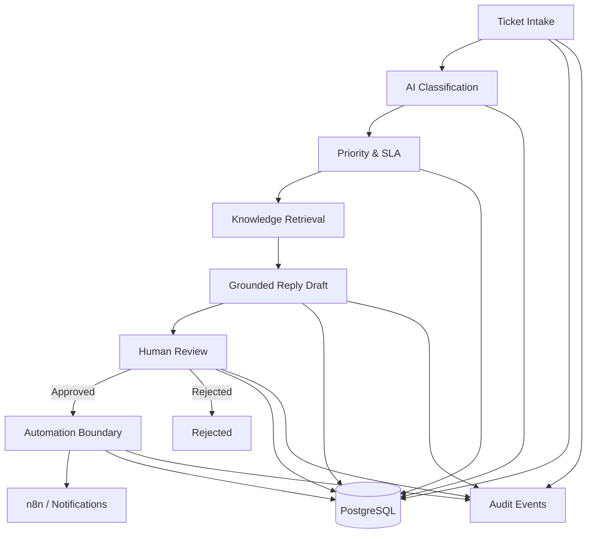
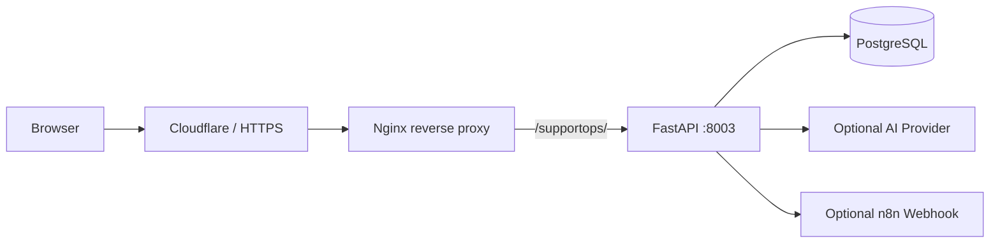

# Architecture

## Overview

AIA SupportOps Automation is a modular support-operations workflow built around explicit stages rather than a single autonomous agent.

## Main components

### API layer
FastAPI exposes ticket, knowledge, review, retry, audit, health, demo, and OpenAPI routes.

### Classification
The classification service produces structured support metadata such as category, urgency, language, summary, confidence, and generation source. The provider is isolated behind an integration boundary so the workflow can fall back safely when an external model is unavailable.

### Priority and SLA
Priority is calculated separately from model classification. This keeps operational policy deterministic and testable.

### Knowledge retrieval
The retrieval layer ranks support knowledge and returns source references plus confidence. It is intentionally isolated so the current lightweight implementation can later be replaced by embedding/vector retrieval without changing the support workflow contract.

### Reply drafting
Drafting only uses retrieved support context. If knowledge is missing or the model fails, the service returns a safe fallback instead of inventing support policy.

### Human review
Drafts move to `waiting_review`. An agent can approve the draft, edit the final response, or reject it. Review identity, note, timestamp, and final status are persisted.

### Automation boundary
Approved tickets may trigger n8n-compatible outbound automation. Delivery state, attempt count, and last error are persisted independently from the approval decision.

### Reliability
Retry is allowed only for approved tickets in retryable states. Already-sent automation is protected against duplicate retry.

### Audit trail
Important lifecycle actions are recorded as audit events, including ticket creation, drafting, review decisions, automation results, and retries.

## Production topology

## Security boundaries

- database is internal to the Docker network
- app binds to `127.0.0.1`
- HTTPS terminates at the existing reverse proxy
- external integrations are environment-controlled
- secrets are not stored in the repository
- public demo runs in safe mode
- human approval precedes outbound automation
